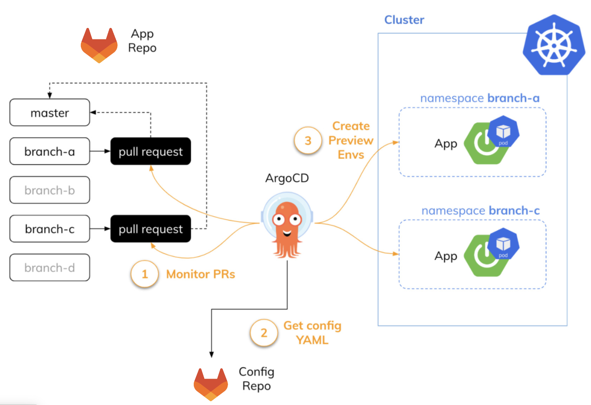

# Preview Environments with ArgoCD

Automated preview environments (also known as ephemeral namespaces) using GitOps approach with ArgoCD, Tekton, and Helm to accelerate the development process.

## Table of Contents

- [What are Preview Environments?](#what-are-preview-environments)
- [Why Use Preview Environments?](#why-use-preview-environments)
- [Architecture Overview](#architecture-overview)
- [How It Works](#how-it-works)
- [Repository Structure](#repository-structure)
- [Setup Guide](#setup-guide)
- [Configuration Details](#configuration-details)

## What are Preview Environments?

Preview environments are temporary, isolated Kubernetes namespaces automatically provisioned for each merge request (MR) or pull request (PR). They allow developers to:

- Test changes in a production-like environment before merging
- Share working features with team members, QA, or stakeholders
- Perform integration tests in isolation
- Validate changes without affecting shared development environments

These environments are **ephemeral** - they exist only while the merge request is open and are automatically cleaned up when the MR is merged or closed.

## Why Use Preview Environments?

**Accelerate Development:**
- Reduce feedback loops by testing in real Kubernetes environments
- Enable parallel development without environment conflicts
- Catch integration issues early before they reach main branches

**Improve Collaboration:**
- Provide reviewers with live applications to test
- Enable non-technical stakeholders to preview features
- Facilitate QA testing before code merge

**GitOps Native:**
- Fully automated using ArgoCD ApplicationSet generators
- Declarative configuration managed in Git
- Self-service deployment without manual intervention

## Architecture Overview



### Two-Repository Model

This implementation follows a **separation of concerns** pattern:

1. **Application Source Repository** (not in this repo)
   - Contains application source code
   - Developers create feature branches and merge requests
   - Webhook events trigger CI/CD pipelines

2. **GitOps Configuration Repository** (this repo)
   - Contains reusable Helm charts for preview environments
   - Defines ArgoCD ApplicationSet for automatic provisioning
   - Stores Tekton pipeline definitions for CI/CD

### Key Components

| Component | Purpose | Location |
|-----------|---------|----------|
| **ArgoCD ApplicationSet** | Monitors GitLab MRs and creates/destroys preview environments | `argocd/my-quarkus-demo-preview-appset.yaml` |
| **App Helm Chart** | Defines Kubernetes resources for the application | `helm/app/` |
| **CI/Build Helm Chart** | Defines Tekton pipelines and webhook triggers | `helm/ci/build/` |
| **Tekton Pipelines** | Builds, scans, and publishes container images | `helm/ci/build/templates/` |

## How It Works

### Lifecycle Flow

```
┌─────────────────────────────────────────────────────────────────┐
│ 1. Developer Creates Merge Request                              │
│    ├── Feature branch pushed to GitLab                          │
│    └── MR opened from feature branch to main                    │
└─────────────────┬───────────────────────────────────────────────┘
                  │
                  ▼
┌─────────────────────────────────────────────────────────────────┐
│ 2. GitLab Webhook Triggers Tekton Pipeline                      │
│    ├── EventListener receives webhook                           │
│    ├── CEL interceptor filters MR opened events                 │
│    └── TriggerTemplate starts preview build pipeline            │
└─────────────────┬───────────────────────────────────────────────┘
                  │
                  ▼
┌─────────────────────────────────────────────────────────────────┐
│ 3. Tekton Pipeline Builds & Publishes Image                     │
│    ├── Clone source code                                        │
│    ├── Build with Maven                                         │
│    ├── Security scan with SonarQube                            │
│    ├── Build & sign container image                             │
│    └── Push to registry with tag: pr-{number}                   │
└─────────────────┬───────────────────────────────────────────────┘
                  │
                  ▼
┌─────────────────────────────────────────────────────────────────┐
│ 4. ArgoCD ApplicationSet Detects MR                             │
│    ├── Pull Request generator polls GitLab API (every 2 min)   │
│    ├── Detects new opened MR                                    │
│    └── Creates ArgoCD Application: app-pr-{number}              │
└─────────────────┬───────────────────────────────────────────────┘
                  │
                  ▼
┌─────────────────────────────────────────────────────────────────┐
│ 5. ArgoCD Deploys Preview Environment                           │
│    ├── Creates namespace: app-pr-{number}                       │
│    ├── Applies Helm chart with MR-specific parameters          │
│    ├── Deploys application with image tag: pr-{number}          │
│    └── Creates Route for external access                        │
└─────────────────┬───────────────────────────────────────────────┘
                  │
                  ▼
┌─────────────────────────────────────────────────────────────────┐
│ 6. Developer & Reviewers Test Preview Environment               │
│    ├── Access via unique Route URL                              │
│    ├── Verify feature functionality                             │
│    └── Push additional commits (rebuilds & redeploys)           │
└─────────────────┬───────────────────────────────────────────────┘
                  │
                  ▼
┌─────────────────────────────────────────────────────────────────┐
│ 7. MR Merged - Automatic Cleanup                                │
│    ├── ArgoCD detects MR state changed to "merged"              │
│    ├── Deletes ArgoCD Application                               │
│    └── Prunes all resources (namespace, deployments, etc.)      │
└─────────────────────────────────────────────────────────────────┘
```

### Event-Driven Triggers

The Tekton EventListener responds to different GitLab webhook events:

| GitLab Event | Filter Condition | Pipeline Action | Image Tag |
|--------------|------------------|-----------------|-----------|
| MR Opened | `object_kind == 'merge_request' && state == 'opened'` | Build preview image | `pr-{number}` |
| MR Merged | `object_kind == 'merge_request' && state == 'merged'` | Build main image | `latest` |
| Tag Push | `object_kind == 'tag_push'` | Promote to pre-prod | `{tag}` |
| Release | `object_kind == 'release'` | Promote to production | `{release}` |

## Repository Structure

```
.
├── argocd/
│   └── my-quarkus-demo-preview-appset.yaml    # ApplicationSet definition
├── helm/
│   ├── app/                                    # Application deployment chart
│   │   ├── Chart.yaml
│   │   ├── values.yaml                         # Default values
│   │   └── templates/
│   │       ├── deployment.yaml                 # Application deployment
│   │       ├── service.yaml                    # ClusterIP service
│   │       ├── route.yaml                      # OpenShift route
│   │       ├── serviceaccount.yaml             # Service account
│   │       ├── rolebinding.yaml                # RBAC permissions
│   │       └── external-secret.yaml            # External secrets integration
│   └── ci/build/                               # CI/CD pipeline chart
│       ├── Chart.yaml
│       ├── values.yaml                         # Pipeline configuration
│       └── templates/
│           ├── my-quarkus-demo-app-el.yaml     # EventListener
│           ├── *-binding-tb.yaml               # TriggerBindings
│           ├── *-run-build-tt.yaml             # TriggerTemplates
│           └── *-build-p.yaml                  # Pipeline definitions
└── images/
    └── preview-envs.png                        # Architecture diagram
```

## Setup Guide

### Prerequisites

- Kubernetes or OpenShift cluster
- ArgoCD installed and configured
- Tekton Pipelines installed
- GitLab instance (or adapt for GitHub/Bitbucket)
- Container registry (Quay, Docker Hub, etc.)
- Optional: SonarQube, StackRox, Sigstore for security scanning

### Installation Steps

1. **Deploy Tekton CI/CD Pipeline**

   Install the build pipeline and EventListener:

   ```bash
   helm install my-app-ci helm/ci/build \
     --namespace my-app-dev \
     --create-namespace \
     --set app.name=my-app \
     --set git.repo=https://gitlab.example.com/org/my-app.git \
     --set image.host=quay.io \
     --set image.organization=myorg
   ```

2. **Configure GitLab Webhook**

   Get the EventListener URL:

   ```bash
   kubectl get route -n my-app-dev el-my-app-el -o jsonpath='{.spec.host}'
   ```

   In GitLab project settings:
   - Go to Settings → Webhooks
   - URL: `http://<eventlistener-url>`
   - Trigger events: Merge Request, Push, Tag Push, Release
   - SSL verification: Configure based on your setup

3. **Deploy ArgoCD ApplicationSet**

   Update `argocd/my-quarkus-demo-preview-appset.yaml` with your configuration:
   - GitLab project ID
   - GitLab API URL
   - Repository URL for this config repo
   - Target ArgoCD project

   Apply the ApplicationSet:

   ```bash
   kubectl apply -f argocd/my-quarkus-demo-preview-appset.yaml
   ```

4. **Test the Setup**

   Create a test merge request in your application repository:

   ```bash
   git checkout -b test-preview
   git commit --allow-empty -m "Test preview environment"
   git push origin test-preview
   # Create MR via GitLab UI or CLI
   ```

   Verify the preview environment is created:

   ```bash
   # Check ArgoCD Application
   kubectl get application -n argocd | grep pr-

   # Check namespace
   kubectl get namespaces | grep pr-

   # Check deployment
   kubectl get pods -n my-app-pr-{number}
   ```

## Configuration Details

### ArgoCD ApplicationSet Parameters

The ApplicationSet uses Go templates to dynamically generate resources:

| Parameter | Source | Usage |
|-----------|--------|-------|
| `.number` | GitLab MR number | Namespace name, image tag |
| `.branch` | Source branch name | For reference/labeling |
| `.head_sha` | Latest commit SHA | Image identification |

Example generated values:
- Application name: `my-app-pr-42`
- Namespace: `my-app-pr-42`
- Image tag: `pr-42`

### Helm Chart Parameters

Key parameters passed to the app Helm chart:

```yaml
helm:
  parameters:
  - name: namespace.name
    value: 'my-app-pr-{{ .number }}'
  - name: environment
    value: dev
  - name: image.tag
    value: 'pr-{{ .number }}'
```

### Sync Policy

Preview environments use aggressive sync settings:

```yaml
syncPolicy:
  automated:
    prune: true          # Delete resources when removed from Git
    selfHeal: true       # Auto-correct manual changes
  syncOptions:
    - CreateNamespace=true    # Auto-create namespaces
    - Replace=true            # Use replace instead of apply
    - ApplyOutOfSyncOnly=true # Only sync changed resources
    - PruneLast=true          # Delete namespace last
```

### Security Pipeline Stages

The build pipeline includes multiple security checks:

1. **Static Code Analysis**: SonarQube scans for code quality and security issues
2. **Dependency Scanning**: CycloneDX generates Software Bill of Materials (SBOM)
3. **Container Scanning**: StackRox scans images for vulnerabilities
4. **Image Signing**: Sigstore signs images for supply chain security

### Customization

To adapt this for your application:

1. **Update chart names**: Replace `my-quarkus-demo-app` with your app name
2. **Modify build steps**: Edit `helm/ci/build/templates/*-build-p.yaml`
3. **Adjust resources**: Update `helm/app/templates/deployment.yaml`
4. **Change base image**: Modify your application's Dockerfile
5. **Configure security tools**: Update URLs in `helm/ci/build/values.yaml`

## Benefits of This Approach

**For Developers:**
- Test in production-like environments immediately
- No manual environment provisioning needed
- Parallel feature development without conflicts

**For Teams:**
- Standardized, reproducible environments
- Early detection of integration issues
- Faster code review cycles with live demos

**For Operations:**
- Fully automated - no manual intervention
- Cost-effective - environments exist only when needed
- GitOps principles - everything in version control

## Troubleshooting

**Preview environment not created:**
- Check ArgoCD ApplicationSet events: `kubectl describe applicationset my-app-preview`
- Verify GitLab API connectivity and credentials
- Check MR state matches filter: `pullRequestState: opened`

**Build pipeline not triggered:**
- Verify webhook is configured in GitLab
- Check EventListener logs: `kubectl logs -n my-app-dev -l eventlistener=my-app-el`
- Test webhook payload matches CEL filter expressions

**Deployment fails:**
- Check ArgoCD Application status: `argocd app get my-app-pr-{number}`
- Verify image exists in registry with correct tag
- Review pod logs: `kubectl logs -n my-app-pr-{number} -l app=my-app`

## Contributing

To extend this configuration:

1. Fork this repository
2. Create a feature branch
3. Test changes with a real merge request
4. Submit a pull request with your improvements

## License

[Add your license information]

## References

- [ArgoCD ApplicationSet Documentation](https://argo-cd.readthedocs.io/en/stable/user-guide/application-set/)
- [Tekton Pipelines](https://tekton.dev/)
- [GitOps Principles](https://opengitops.dev/)